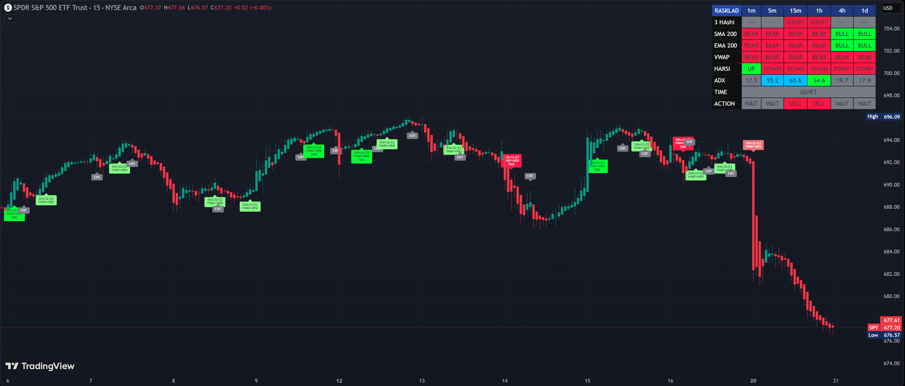

# Chotkiy Rasklad v1.5

**Chotkiy Rasklad v1.5** is a professional Multi-Timeframe (MTF) trend scanner and volatility analyzer for TradingView.

Designed for precision scalping and day trading, it eliminates market noise by enforcing a strict "Confluence" rule: a trade is only valid when **Price Structure**, **Institutional Trends**, and **Volatility (ADX)** align perfectly across multiple timeframes.

---

## 🚀 New in v1.5: The ADX Color Engine

The core upgrade in version 1.5 is the **Volumetric Volatility Filter**. The dashboard now color-codes the ADX value to give you instant context on market energy:

| ADX Color | Value | Market State | Action |
| :--- | :--- | :--- | :--- |
| **Gray** ⚪ | `< 20` | **Choppy / Dead** | ⛔ **NO TRADE.** The market has no direction. |
| **Yellow** 🟡 | `20 - 25` | **Waking Up** | ⚠️ Watch closely. A trend is likely forming. |
| **Green** 🟢 | `26 - 50` | **Prime Trend** | ✅ **GO.** The best zone for entries. Strong momentum. |
| **Sky Blue** 🔵 | `> 50` | **Parabolic** | 🔥 **EXTREME.** Market is overheated. Expect a reversal or exhaustion. |

---

---
## 📊 Features

* **MTF Dashboard:** Real-time monitoring of trend and signal status for **1m, 5m, 15m, 1h, 4h, and 1D**.
* **Institutional Bias:** Filters signals based on the relation to **SMA 200**, **EMA 200**, and **VWAP**.
* **Heikin Ashi Structure:** Detects valid 3-candle breakouts to filter out single-candle fakeouts.
* **Session Awareness:** Flags the "Opening Mess" (first 15 mins of US session) and highlights Morning/Evening sessions.
* **Smart Alerts:** Configurable alerts that trigger only when all conditions (Trend + Momentum + Structure) are met.

---

## 🧠 Strategy Logic

The indicator uses a "Waterfall" logic system. A **BUY** or **SELL** signal is generated strictly when **ALL** conditions below are met simultaneously:

### 1. Trend Filter (The Bias)
* **Long:** Price must be ABOVE SMA 200, EMA 200, and VWAP.
* **Short:** Price must be BELOW SMA 200, EMA 200, and VWAP.

### 2. Momentum Filter (HARSI)
* Uses **Heikin Ashi RSI**. Must be > 50 for Longs and < 50 for Shorts.

### 3. Entry Trigger
* Requires a sequence of **3 consecutive Heikin Ashi candles** in the trend direction (Green for Long, Red for Short).

---

## ⚙️ Configuration

You can customize the indicator settings via the TradingView inputs menu:

### Global Filters
* **SMA/EMA Length:** Default is `200` (Institutional standard).
* **HARSI Settings:** Adjust RSI length and smoothing for faster/slower reactions.

### Dashboard
* **Show Dashboard:** Toggle ON/OFF.
* **Size:** Select `Tiny`, `Small`, or `Normal` (v1.5 defaults to Small).
* **Offset:** Adjust vertical/horizontal positioning to fit your screen layout.

### Time Settings
* Configure session times (Opening, Morning, Evening) to match your local exchange hours.

---

## 📥 Installation

1.  Copy the code from `Chotkiy_Rasklad_v1.5.pine`.
2.  Open **TradingView Chart**.
3.  Open the **Pine Editor** (bottom panel).
4.  Paste the code and click **Save**.
5.  Click **Add to Chart**.

---

## ⚠️ Disclaimer

This project is for **educational purposes only**. It does not constitute financial advice. Trading financial markets involves high risk, and you may lose your capital. Always use proper risk management (stop-losses) and do your own research.

---

## 📄 License

This project is licensed under the **Mozilla Public License 2.0**.
See the [LICENSE](LICENSE) file for details.

---

**© 2026 Sergei Seivach**
